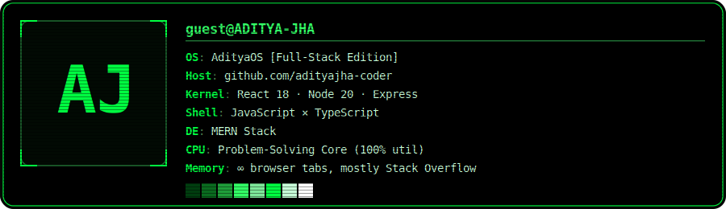

<div align="center">



</div>

<br/>

<div align="center">

[](https://github.com/adityajha-coder)
[](https://github.com/adityajha-coder)

</div>


## `$ whoami`

```diff
+ Full-Stack Developer (MERN) who turns vague 2 AM ideas into things people can click on.
+ I like owning the whole chain — schema to server to pixel-perfect frontend.
+ Currently deep in React / Next.js, with Node, Express, and MongoDB doing the heavy lifting.
+ Perpetually mid-refactor. Send help, or better, send a pull request.
```


## `$ neofetch`

<div align="center">

</div>


## `$ ls ~/tech-stack --tree`

```
~/tech-stack
├── languages/    →  C · C++ · JavaScript · TypeScript · HTML · CSS
├── frontend/     →  React · Next.js · Tailwind · Three.js · Framer Motion · GSAP
├── backend/      →  Node.js · Express · MongoDB · MySQL · Firebase · Supabase
└── tools/        →  Git · GitHub · VS Code · Postman · Docker · Vercel
```

<div align="center">

<br/>
<br/>
<br/>


</div>


## `$ cat stats.log`

<table align="center">
<tr>
<td></td>
<td></td>
</tr>
</table>

<div align="center">

</div>

<div align="center">

</div>


## `$ git log --graph --contributions`

<div align="center">


<!-- Contribution snake — appears after the snake.yml workflow (included alongside this README) runs once on your repo -->

</div>


<details>
<summary><code>$ sudo access --secret-log</code></summary>
<br/>

```diff
+ [ACCESS GRANTED]
+ Located: 47 unfinished side-projects, 12 browser windows with 80+ tabs each,
+ 1 to-do list that has never once reached zero.
+ Status: shipping anyway.
```

</details>


## `$ ping contact --live`

<div align="center">

[](mailto:developer.adityajha@gmail.com)
[](https://www.linkedin.com/in/aditya-jha-8534a1305/)
[](https://github.com/adityajha-coder)
[](https://www.instagram.com/adjzyy/)
[](https://x.com/adityajha_7)

</div>


<div align="center">


<br/>

`process exited with code 0 — see you in the next commit`

</div>